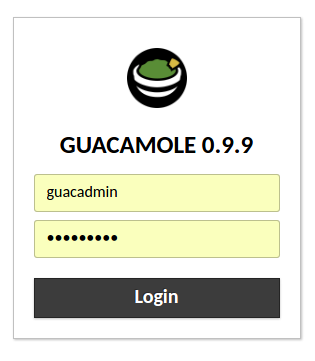
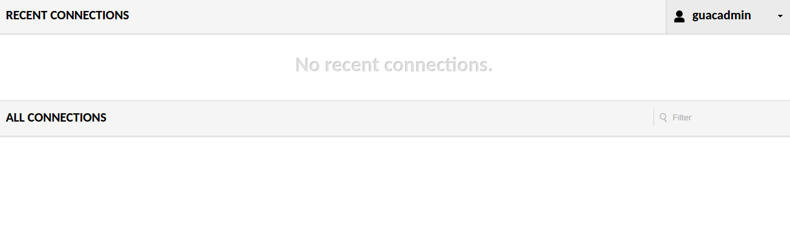
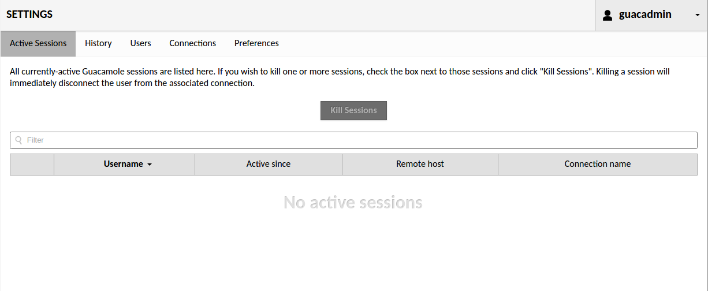
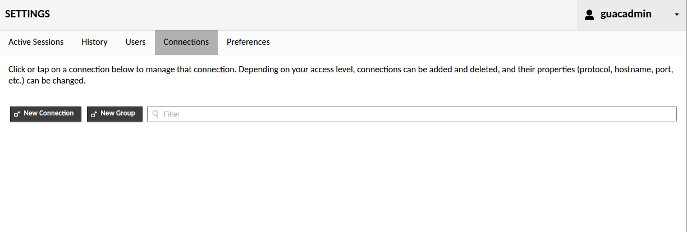
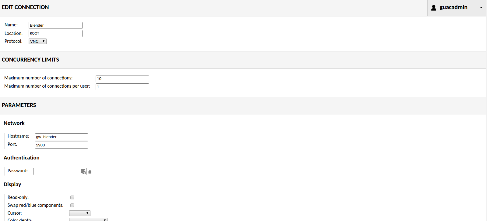
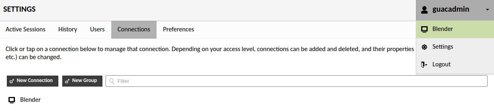
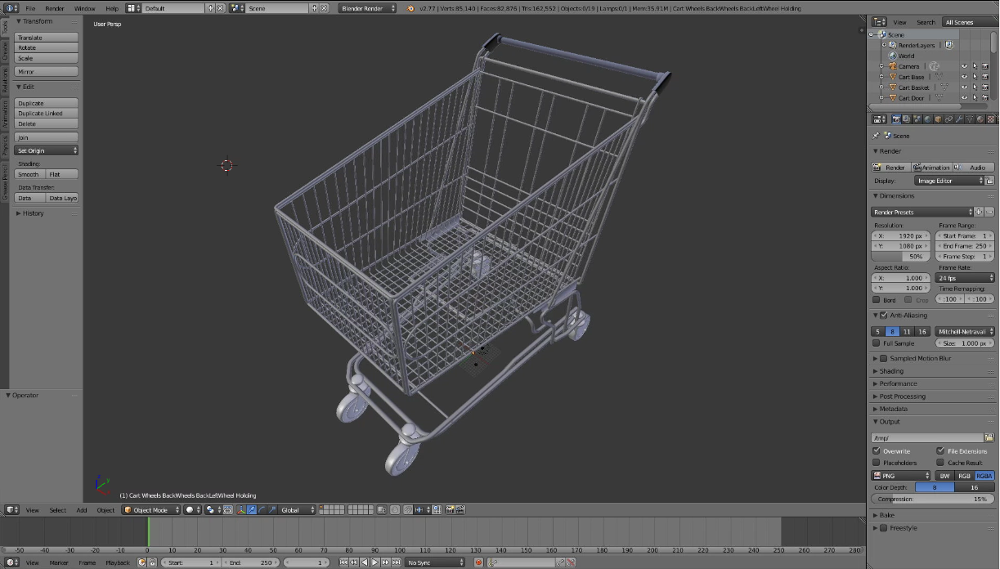

# Intermediate exercise
The goal of this exercise is to make Blender available in the browser using Guacamole. We will start our web service using [Docker Compose](https://docs.docker.com/compose/) and configure Guacamole such that we can use Blender within the browser.

**Note: In the interest of time, this exercise will be run locally on your system using Docker containers. Exposing the service to the outside world is beyond the scope of this exercise (of course guidance can be provided off-line).**

Please make sure you have all the necessary [prerequisites](../prerequisites/guide.md) before going any further.

## Web service anatomy
The [Docker Compose](https://docs.docker.com/compose/) file located [here](docker-compose.yml) defines the required services and how they are linked:

```yml
version: '2'

services:
  gw_guacd:
    image: glyptodon/guacd:0.9.9
    container_name: gw.intermediate.guacd
    networks:
      - default

  gw_guacdb:
    image: gw_guacdb
    container_name: gw.intermediate.guacdb
    volumes:
      - /var/lib/mysql:/var/lib/mysql
    environment:
      MYSQL_USER: root
      MYSQL_ROOT_PASSWORD: demo
      MYSQL_DATABASE: guacamole
    networks:
      - default

  gw_guac:
    image: glyptodon/guacamole:0.9.9
    container_name: gw.intermediate.guac
    depends_on:
      - gw_guacd
      - gw_guacdb
    environment:
      MYSQL_HOSTNAME: gw_guacdb
      MYSQL_DATABASE: guacamole
      MYSQL_USER: root
      MYSQL_PASSWORD: demo
      GUACD_PORT_4822_TCP_ADDR: gw_guacd
      GUACD_PORT_4822_TCP_PORT: 4822
    networks:
      - default

  gw_proxy:
    build: images/gw_proxy
    container_name: gw.intermediate.proxy
    volumes:
      - /var/run/docker.sock:/tmp/docker.sock:ro
    depends_on:
      - gw_guac
    ports:
      - 80:80
    networks:
      - default

  gw_blender:
    image: gw_blender
    container_name: gw.intermediate.blender
    environment:
      BLENDER_FILE: shopping_cart.blend
    networks:
      - default
```

This web service consists of the following parts:  
1. **gw_guacd**  
The Guacamole Daemon container that connects with remote desktops over any arbitrary protocol
2. **gw_guacdb**  
The Database container with Guacamole schema as produced earlier in the [prerequisites](../prerequisites/guide.md)
3. **gw_guac**  
The Guacamole server container. It connects to the Guacamole daemon container **gw_guacd** and the Database container **gw_guacdb**
4. **gw_proxy**  
An NGINX reverse proxy for routing traffic from `localhost:80` to the the appropriate container Guacamole container at `http://gw_guac:8080/guacamole/`.
5. **gw_blender**  
A Blender container as produced earlier in the [prerequisites](../prerequisites/guide.md). Later on this exercise you will configure Guacamole such that you can interact with Blender from the browser. The container is provided with an environment variable BLENDER_FILE which the container uses to load the proper Blender scene:  
```yml
    environment:
      BLENDER_FILE: shopping_cart.blend
```
    
## Step 1: Starting the Guacamole web service
1. Open a terminal and navigate to `{clone_dir}/intermediate/source`
2. Ensure no other service is occupying localhost:80 (e.g. the [advanced](../advanced/exercise.md) exercise)
3. Run `docker-compose up`  

## Step 2: Configure Guacamole
1. In a browser of choice, navigate to [http://localhost](http://localhost)
2. You will be presented with a login page:  
  
3. Enter the following credentials: *guacadmin/guacadmin*
4. The **home** page appears:

5. Click the **guacadmin** button at the top right and choose **settings**
6. The **settings** page appears:  
  
7. Go to the **connections** tab:  

8. And click **new connection**
9. The **edit connection** page appears  

10. Fill out this form with the settings above  
The host parameter is set to the service name (blender) in the [Docker Compose](https://docs.docker.com/compose/) file:
    ```yml
    gw_blender:
        image: gw_blender
        container_name: gw.intermediate.blender
        environment:
          BLENDER_FILE: shopping_cart.blend
        networks:
          - default
    ```
11. Click **save** at the bottom of the form
12. Click the **guacadmin** button at the top right and choose **Blender** to connect:

12. If the connection is successfully established you should see the Blender GUI with a mesh models of a shopping cart:
  
You can click **Ctrl + Alt + Shift** at any time to open the **settings** sidebar

**Note: The URL in the address bar can be shared with others to enable collaboration (multiple users share control over the remote desktop)**  
