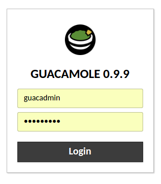
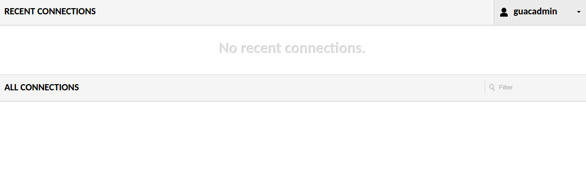
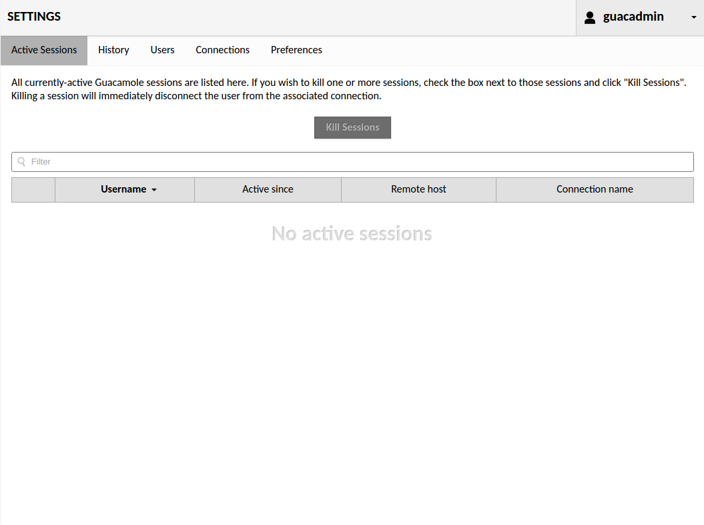
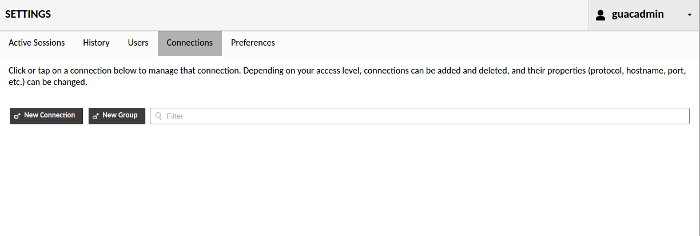
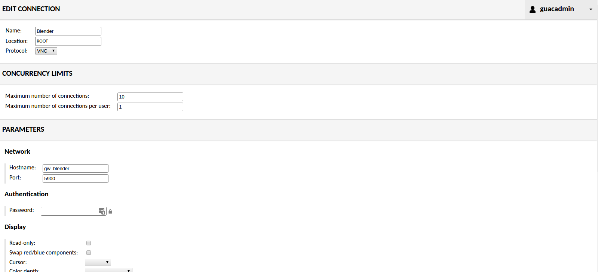

# Intermediate exercise
The goal of this exercise is to make Blender available in the browser using Guacamole. We will start our web service using [Docker Compose](https://docs.docker.com/compose/) and configure Guacamole so that we can use Blender within the browser.

**Note: In the interest of time, this exercise will be run locally on your system using Docker containers. Exposing the service to the outside world is beyond the scope of this exercise (of course guidance can be provided off-line).**

Please make sure you have all the necessary [prerequisites](../prerequisites/exercise.md) before going any further.

## Step 1: Starting the Guacamole web service
1. Open a terminal and navigate to `{clone_url}/intermediate/source`
2. Run `docker-compose up`

## Step 2: Configure Guacamole
1. In a browser of choice, navigate to [localhost](http://localhost)
2. You will be presented with a login page:  
  
3. Enter the following credentials: *guacadmin/guacadmin*
4. The home page appears:

5. Click the **guacadmin** button at the top right and choose **settings**
6. The settings page appears:  
  
7. Go to the **connections** tab:  

8. And click **new connection**
9. The **edit connection** page appears  

10. Fill out this form with the settings above  
The host parameter is set to the service name (blender) in the [Docker Compose](https://docs.docker.com/compose/) file:
  ```yml
    # Blender container
    blender:
      # Blender image from the local Docker registry (created in the prerequisites section)
      image: blender
      container_name: intermediate.blender
      environment:
        # The mesh model to load in Blender
        BLENDER_FILE: shopping_cart.blend
      networks:
        - default
        ```


*Press Ctrl + Alt + Shift to go to the settings menu during active connection
